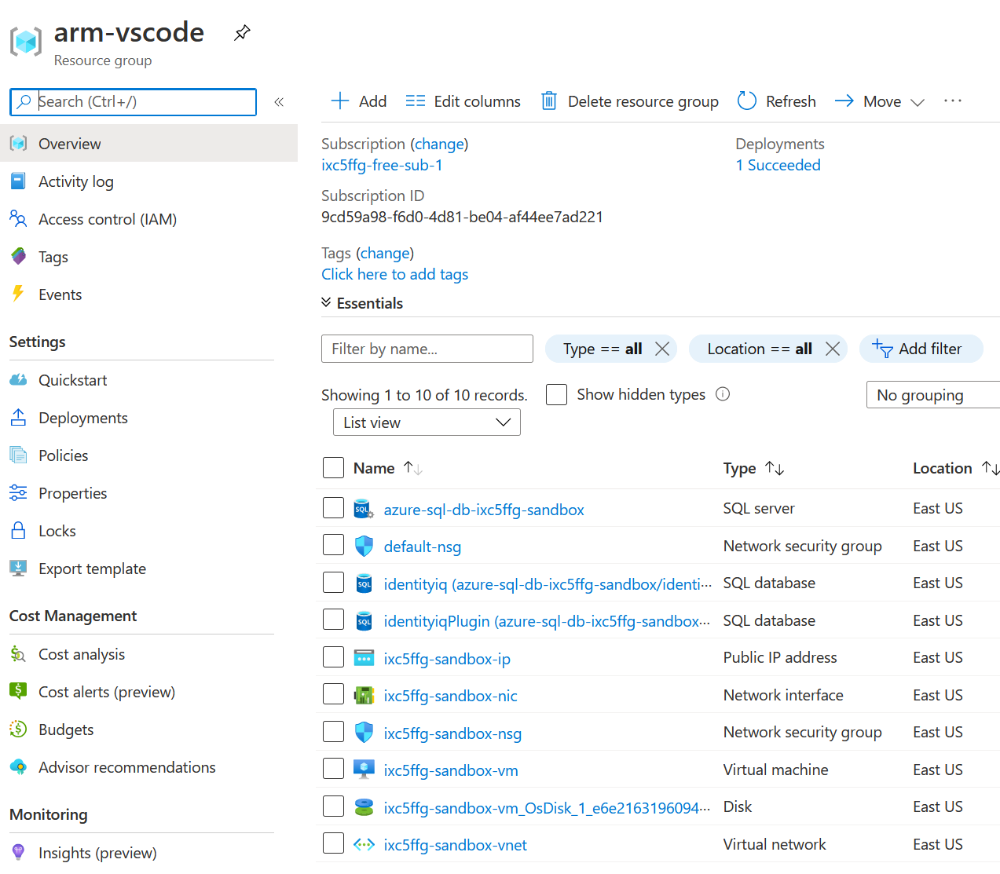

# Azure Resource Manager Tutorial #4

This tutorial builds on Tutorial #3. This template will also provision an instance of Azure SQL and create the databases needed for IdentityIQ.

When this template deployment completes, you will have and environment with:
* A RHEL-7 VM with Java and Tomcat installed
* An instance of Azure SQL with the `identityiq` and `identityiqPlugin` databases created (but no tables created)



## Instructions

Review the `azuredeploy.paramters.json` file to make any changes such as changing the version  Java / Tomcat.

1. Download and install the Azure CLI.
2. Login to Azure
    ```shell script
    $> az login
    ```
3. List your existing subscriptions.
    ```shell script
    $> az account list --output table
    ```
4. Specify the subscription you wish to use. This step is optional if you already have a default subscription set.
    ```shell script
    $> az account set --subscription "ixc5ffg-free-sub-1"
    ```
5. Create the resource group from the template
    ```shell script
    $> az group create --name arm-vscode --location eastus
    ```
6. Update parameters file to specify the paramter values. Use below command to determine the VM offerings.
    ```shell script
    $> az vm image list --output table
    ```    
7. Validate the template
    ```shell script
    $> az deployment group validate --resource-group arm-vscode --template-file azuredeploy.json --parameters azuredeploy.parameters.json
    ```
8. Create the resources
    ```shell script
    $> az deployment group create --resource-group arm-vscode --template-file azuredeploy.json --parameters azuredeploy.parameters.json
    ```
9. Delete resources after use
    ```shell script
    $> az group delete --name arm-vscode